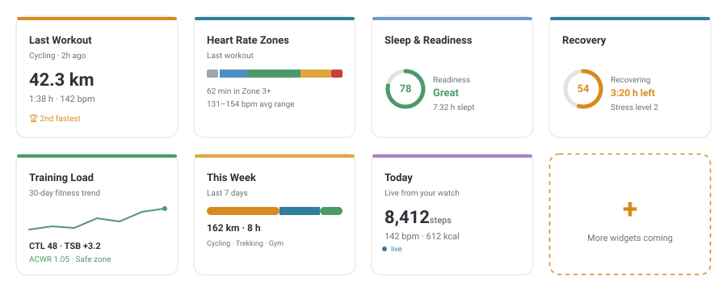

# Suunto Cards

Custom Lovelace cards for [`ha-suunto`](https://github.com/MichalZaniewicz/ha-suunto) (the
`suunto_app` integration) - a purpose-built widget family instead of wiring generic entity/gauge
cards to its 74 sensors by hand.

<picture>
  <source media="(prefers-color-scheme: dark)" srcset="docs/screenshots/cards-overview-dark.svg">
  
</picture>

*Preview mockups with sample data - not a live screenshot. Every card actually themes with your
real Home Assistant light/dark theme automatically (see [Design](#design) below).*

## Cards

| Card | `type` | What it shows |
|---|---|---|
| Last Workout | `custom:suunto-last-workout-card` | Activity, distance/duration, avg &amp; max HR, pace or speed, training effect, EPOC, feeling, TSS, weather, tags and route achievements |
| Heart Rate Zones | `custom:suunto-hr-zones-card` | Time in each of the 5 HR zones from your last workout, with the bpm thresholds |
| Sleep &amp; Readiness | `custom:suunto-sleep-readiness-card` | Sleep stages (deep/light/REM), quality, SpO2, HRV &amp; resting HR vs. your baseline, today's readiness score, naps |
| Recovery | `custom:suunto-recovery-card` | Recovery balance ring, countdown until fully recovered, stress level |
| Training Load | `custom:suunto-training-load-card` | Fitness/Fatigue/Form (CTL/ATL/TSB) with a 30-day trend line, plus ACWR and its safe-zone banding |
| Week &amp; Lifetime | `custom:suunto-week-stats-card` | This week's distance/time/workout count, and a lifetime breakdown by activity |
| Today | `custom:suunto-today-card` | Live steps, energy and heart rate for today |

Each card auto-detects your Suunto device - **zero YAML required** for the common case of one
Suunto account. If you ever have more than one, the card's visual editor shows a device picker.

```yaml
type: custom:suunto-last-workout-card
```

Optional config (only needed with multiple Suunto devices):

```yaml
type: custom:suunto-last-workout-card
device_id: abcdef0123456789
```

## Requirements

- Home Assistant with [`ha-suunto`](https://github.com/MichalZaniewicz/ha-suunto) (`suunto_app`)
  already set up.
- HACS, to add this as a custom repository (category: **Dashboard**/Lovelace plugin) once it's
  pushed to GitHub - not done yet, this repo is currently local-only. Until then, copy
  `dist/suunto-cards.js` into your `<config>/www/` folder and add it as a Lovelace resource
  (Settings → Dashboards → Resources → `/local/suunto-cards.js`, type: JavaScript module).

## Design

Every card is a real `ha-card`, so it inherits your Home Assistant theme's colors, radius and
shadow automatically. The brand accent (amber) and a cool secondary accent (used for HR-related
numbers) come from the `ha-suunto` brand icon itself, so this repo reads as the same product
family. Semantic colors (good/warning/bad - used for training effect, recovery balance, ACWR,
HRV vs. baseline, and readiness) are deliberately separate from that brand accent. See
[`src/utils/style-tokens.ts`](src/utils/style-tokens.ts) for the full token set.

## Development

```bash
npm install
npm run build       # -> dist/suunto-cards.js (committed to the repo, HACS serves it directly)
npm run watch        # rebuild on change
npm run typecheck    # tsc --noEmit across the whole src/ tree
```

No live Home Assistant instance is needed to work on these cards. Open
[`dev/index.html`](dev/index.html) in a browser after building - it loads the real compiled
bundle against a hand-built mock `hass` object covering every card in both its normal and empty
state, with a light/dark toggle. It stubs just enough of `ha-card`/`ha-icon` to render; it's a
logic/data-binding check, not a pixel-accurate preview (that's what the mockups above are for).

### Adding a new card

1. Add `src/suunto-<name>-card.ts` extending `SuuntoBaseCard` ([`src/utils/base-card.ts`](src/utils/base-card.ts)) -
   it gives you dark-mode sync, device resolution and a consistent empty/error state for free.
2. Reuse [`src/utils/style-tokens.ts`](src/utils/style-tokens.ts) (`suuntoTokens` +
   `suuntoSharedStyles`) and [`src/utils/render-helpers.ts`](src/utils/render-helpers.ts)
   (`segmentedBar`, `progressRing`, `sparkline`) before writing new CSS/SVG - most layouts in this
   family are built entirely from those two files.
3. Register it in [`src/suunto-cards.ts`](src/suunto-cards.ts) (one `import` + one
   `window.customCards.push(...)` entry). `getConfigElement()` can almost always just return
   `document.createElement("suunto-device-editor")` - every card's config is currently just an
   optional `device_id`.
4. Add a mock-data entry per new `translation_key` in [`dev/index.html`](dev/index.html) and
   verify both the happy-path and empty-state render.

## Status

Local, not yet published. Not on HACS or GitHub yet - that's a deliberate next step, not an
oversight. Entity discovery reads Home Assistant's entity registry by `translation_key`, which
this integration sets equal to each sensor's internal key (`last_distance`, `fitness_ctl`, ...) -
that keeps discovery language-independent and immune to the user renaming entities, instead of
hardcoding `sensor.<device>_last_distance`-style entity IDs.
