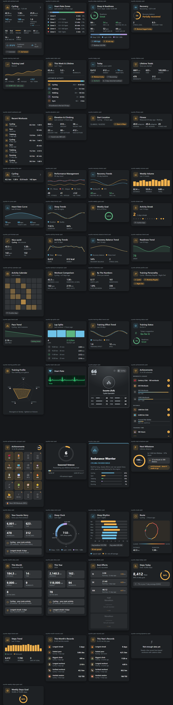

# Suunto Cards

Custom Lovelace cards for [`ha-suunto`](https://github.com/MichalZaniewicz/ha-suunto) (the
`suunto_app` integration) - a purpose-built widget family instead of wiring generic entity/gauge
cards to its 74 sensors by hand.

[](https://my.home-assistant.io/redirect/hacs_repository/?owner=MichalZaniewicz&repository=ha-suunto-cards&category=plugin)



> [!TIP]
> ⭐ **Enjoying these cards?** Every star is real motivation to keep building new features :)

<!-- The badge lives OUTSIDE the alert on purpose: Home Assistant/HACS rewrites a GitHub alert
into <ha-alert> and drops every child whose textContent is empty, which silently removes any
 placed inside it. -->

[](https://github.com/MichalZaniewicz/ha-suunto-cards)

## Cards

| Card | `type` | What it shows |
|---|---|---|
| Last Workout | `custom:suunto-last-workout-card` | Activity, distance/duration, avg &amp; max HR, pace or speed, training effect, EPOC, feeling, TSS, weather, tags and route achievements |
| Heart Rate Zones | `custom:suunto-hr-zones-card` | Time in each of the 5 HR zones from your last workout, with the bpm thresholds |
| Sleep &amp; Readiness | `custom:suunto-sleep-readiness-card` | Sleep stages (deep/light/REM), quality, SpO2, HRV &amp; resting HR vs. your baseline, today's readiness score, naps |
| Recovery | `custom:suunto-recovery-card` | Recovery balance ring, countdown until fully recovered, stress level |
| Training Load | `custom:suunto-training-load-card` | Fitness/Fatigue/Form (CTL/ATL/TSB) with a 30-day trend line, plus ACWR and its safe-zone banding |
| Week &amp; Lifetime | `custom:suunto-week-stats-card` | This week's distance/time/workout count, and a lifetime breakdown by activity |
| Today | `custom:suunto-today-card` | Live steps, energy and heart rate for today |
| Lifetime Totals | `custom:suunto-lifetime-card` | Total distance, time, energy, workouts and active days since you started |
| Recent Workouts | `custom:suunto-recent-workouts-card` | A scrollable log of your last 15 workouts - activity, distance and duration |
| Elevation &amp; Climbing | `custom:suunto-elevation-card` | Ascent, descent, climb/descend times, min/max altitude and ascent rate for your last workout |
| Start Location | `custom:suunto-location-card` | Where your last workout started, with a one-tap link to open it in Maps |
| Fitness | `custom:suunto-fitness-card` | VO2max, estimated VO2max and fitness age, with when they were last measured |
| Last Workout (compact) | `custom:suunto-last-workout-tile-card` | A single-row summary of your last workout, for denser dashboards |
| Performance Management | `custom:suunto-pmc-card` | CTL/ATL/TSB plotted together over a 90-day trend - the classic fitness/fatigue/form chart |
| Recovery Trends | `custom:suunto-recovery-trends-card` | Resting HR and HRV trend lines over 30 days, each against its own baseline |
| Weekly Volume | `custom:suunto-weekly-volume-card` | A 12-week bar chart of training distance, with the average and total |

Each card auto-detects your Suunto device - **zero YAML required** for the common case of one
Suunto account. If you ever have more than one, the card's visual editor shows a device picker.

```yaml
type: custom:suunto-last-workout-card
```

Optional config (only needed with multiple Suunto devices):

```yaml
type: custom:suunto-last-workout-card
device_id: abcdef0123456789
```

## Languages

Every label follows your Home Assistant language automatically - English, Polish, German,
Portuguese, French, Spanish, Italian and Dutch are built in (`src/translations/`). Anything else
falls back to English. Adding a language is one new typed file - see
[Adding a language](#adding-a-language) below.

## Installation

1. HACS → ⋮ → **Custom repositories** → add this repo as category **Dashboard** (or use the
   badge above) → install **Suunto Cards**.
2. Add a card to any dashboard with `type: custom:suunto-last-workout-card` (or any other type
   from the table above) - no other configuration needed for a single Suunto account.

Manual install: copy `dist/suunto-cards.js` into `<config>/www/`, then Settings → Dashboards →
Resources → add `/local/suunto-cards.js` as a JavaScript module.

Requires [`ha-suunto`](https://github.com/MichalZaniewicz/ha-suunto) (`suunto_app`) already set up.

## Design

Every card is a real `ha-card`, so it inherits your Home Assistant theme's colors, radius and
shadow automatically. The brand accent (amber) and a cool secondary accent (used for HR-related
numbers) come from the `ha-suunto` brand icon itself, so this repo reads as the same product
family. Semantic colors (good/warning/bad - used for training effect, recovery balance, ACWR,
HRV vs. baseline, and readiness) are deliberately separate from that brand accent. See
[`src/utils/style-tokens.ts`](src/utils/style-tokens.ts) for the full token set.

## Development

```bash
npm install
npm run build       # -> dist/suunto-cards.js (committed to the repo, HACS serves it directly)
npm run watch        # rebuild on change
npm run typecheck    # tsc --noEmit across the whole src/ tree
```

No live Home Assistant instance is needed to work on these cards. Open
[`dev/index.html`](dev/index.html) in a browser after building - it loads the real compiled
bundle against a hand-built mock `hass` object covering every card in both its normal and empty
state, with a light/dark toggle and a language switcher. `ha-card`/`ha-icon` are re-implemented as
real shadow-DOM custom elements reading the same theme variables Home Assistant would set.

### Adding a new card

1. Add `src/suunto-<name>-card.ts` extending `SuuntoBaseCard` ([`src/utils/base-card.ts`](src/utils/base-card.ts)) -
   it gives you dark-mode sync, device resolution and a consistent empty/error state for free.
2. Reuse [`src/utils/style-tokens.ts`](src/utils/style-tokens.ts) (`suuntoTokens` +
   `suuntoSharedStyles`) and [`src/utils/render-helpers.ts`](src/utils/render-helpers.ts)
   (`segmentedBar`, `progressRing`, `sparkline`, `multiLineChart`, `barChart`) before writing new
   CSS/SVG - most layouts in this family are built entirely from those two files. Any SVG shape
   built inside a `.map()` (multiple lines/bars) must use Lit's `svg` tag for that inner fragment,
   not `html` - a nested `html` template creates its elements outside the SVG namespace, so they
   render invisibly even though their attributes look correct in the DOM.
3. Register it in [`src/suunto-cards.ts`](src/suunto-cards.ts) (one `import` + one
   `window.customCards.push(...)` entry). `getConfigElement()` can almost always just return
   `document.createElement("suunto-device-editor")` - every card's config is currently just an
   optional `device_id`.
4. Every user-facing string goes through `t(hass, key)` from
   [`src/utils/localize.ts`](src/utils/localize.ts) - add the key to
   [`src/translations/en.ts`](src/translations/en.ts) first (the canonical key list) and
   TypeScript will then require it in all 7 other language files.
5. Add a mock-data entry per new `translation_key` in [`dev/index.html`](dev/index.html) and
   verify both the happy-path and empty-state render.

### Adding a language

Copy `src/translations/en.ts` to `src/translations/<code>.ts`, translate every value (TypeScript
will error if a key is missing or extra), then register it in `LANGUAGES` in
[`src/utils/localize.ts`](src/utils/localize.ts).

## Status

Entity discovery reads Home Assistant's entity registry by `translation_key`, which this
integration sets equal to each sensor's internal key (`last_distance`, `fitness_ctl`, ...) - that
keeps discovery language-independent and immune to the user renaming entities, instead of
hardcoding `sensor.<device>_last_distance`-style entity IDs.

## Disclaimer

An unofficial companion to an unofficial integration - not affiliated with or endorsed by Suunto.
